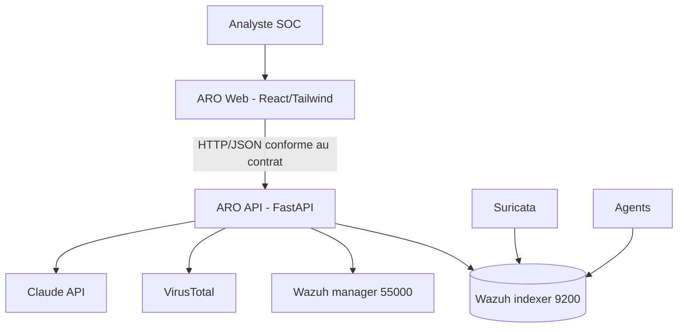
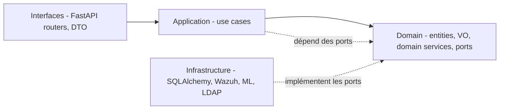

# ARO — Guide d'architecture & conventions d'ingénierie

> Plateforme de supervision de sécurité pilotée par IA.
> Backend **Python / FastAPI** · Frontend **React + TailwindCSS v4**.
> Principes : **OpenAPI-first**, **DDD**, **architecture hexagonale**, **SOLID**, **Clean Code**,
> **tests unitaires partout**.

Ce document est la référence unique de l'équipe. Tout code fusionné doit le respecter.

---

## 1. Principes directeurs

1. **Le contrat avant le code (OpenAPI-first).** `contracts/openapi.yaml` est la source de vérité.
   Le backend et le frontend en dérivent leurs types ; la CI échoue en cas de dérive.
2. **Le domaine est roi (DDD).** La logique métier vit dans une couche `domain` pure, sans aucune
   dépendance à FastAPI, à la base de données ou à un client HTTP.
3. **Dépendances vers l'intérieur (hexagonal).** Les couches externes (HTTP, DB, Wazuh) dépendent
   du domaine via des *ports* (interfaces) ; jamais l'inverse.
4. **SOLID systématique.** Petites unités, à responsabilité unique, ouvertes à l'extension,
   dépendant d'abstractions.
5. **Rien n'est livré sans test.** Chaque entité, value object, use case et adaptateur a ses tests.
6. **Clean Code.** Lisible avant d'être malin ; nommer explicitement ; pas de logique dans les
   contrôleurs.

---

## 2. Vue d'ensemble du système



ARO ne remplace pas la collecte : il consomme les API existantes (indexeur Wazuh, manager,
Suricata, VirusTotal), ajoute une couche d'analyse IA (scoring + explication via Claude) et
expose un dashboard unifié.

---

## 3. Architecture logicielle (DDD + hexagonale)

### 3.1 Les quatre couches



- **Domain** — le métier pur. Entités, value objects, agrégats, services de domaine, et les
  *ports* (interfaces de repository et de passerelles). Aucune dépendance externe, testable en
  mémoire, ultra-rapide.
- **Application** — orchestration. Les *use cases* coordonnent le domaine pour réaliser une
  intention métier. Dépendent uniquement des ports du domaine.
- **Infrastructure** — les *adaptateurs* qui implémentent les ports : persistance SQLAlchemy,
  client indexeur Wazuh, client manager, modèles ML, LDAP, VirusTotal, Claude.
- **Interfaces** — la couche d'entrée : routers FastAPI, schémas Pydantic (dérivés du contrat),
  mapping DTO ↔ domaine, injection de dépendances, gestion des erreurs HTTP.

La règle d'or : **les flèches de dépendance pointent toujours vers le domaine.**

### 3.2 Bounded contexts

ARO est découpé en contextes métier autonomes :

| Contexte | Responsabilité |
|---|---|
| `detection` | Détection d'anomalies réseau et de phishing (modèles ML, scoring). |
| `alerting` | Cycle de vie d'une alerte : criticité, triage, faux positif, explication. |
| `integration` | Passerelles vers Wazuh, Suricata, VirusTotal. |
| `identity` | Authentification LDAP, rôles `admin` / `user`. |
| `shared` | Types et value objects transverses (Ip, Criticity, Timestamp…). |

Chaque contexte possède sa propre arborescence `domain / application / infrastructure`.

### 3.3 Briques tactiques DDD

- **Value Object** — immuable, défini par sa valeur, auto-validant (ex. `IpAddress`, `Criticity`).
- **Entity** — identité stable dans le temps (ex. `Alert` avec son `AlertId`).
- **Aggregate** — grappe cohérente avec une racine garante des invariants (ex. `Alert` racine).
- **Domain Service** — logique métier sans état naturel d'entité (ex. `CriticityPolicy`).
- **Port (Repository / Gateway)** — interface abstraite déclarée dans le domaine.
- **Use Case** — un service applicatif = une intention (ex. `TriageAlertUseCase`).

---

## 4. OpenAPI-first : le contrat guide le code

### 4.1 Pourquoi
Le contrat fige l'interface entre back et front. Les deux côtés génèrent leurs types depuis le
même fichier : impossible d'avoir un champ mal typé ou un endpoint divergent sans que la CI le
détecte.

### 4.2 Workflow par fonctionnalité

1. **Écrire / modifier** `contracts/openapi.yaml` (le contrat d'abord).
2. **Linter** le contrat : `spectral lint contracts/openapi.yaml`.
3. **Générer les modèles backend** (Pydantic v2, en lecture seule) :
   ```bash
   datamodel-codegen --input contracts/openapi.yaml \
     --output api/src/aro/interfaces/http/schemas/_generated.py \
     --output-model-type pydantic_v2.BaseModel
   ```
4. **Générer les types & le client frontend** :
   ```bash
   npx openapi-typescript contracts/openapi.yaml -o web/src/api/schema.d.ts
   ```
   (client typé via `openapi-fetch`).
5. **Implémenter** domaine → use case → adaptateurs → router, conformes au contrat.
6. **Tests de contrat** (property-based) avec Schemathesis :
   ```bash
   schemathesis run --base-url http://localhost:8000 contracts/openapi.yaml
   ```
7. **Détection de dérive** en CI : comparer le schéma généré par FastAPI (`app.openapi()`) au
   contrat versionné ; la CI échoue s'ils divergent.

> Règle : **les fichiers générés ne sont jamais édités à la main** (suffixe `_generated`,
> exclus du lint). On modifie le contrat, on régénère.

---

## 5. Backend — Python / FastAPI

### 5.1 Arborescence (par contexte puis par couche)

```
api/
├── pyproject.toml
├── src/aro/
│   ├── domain/
│   │   ├── shared/                 # value objects transverses
│   │   │   └── value_objects.py    # IpAddress, Criticity, AlertId...
│   │   └── alerting/
│   │       ├── entities.py         # Alert (agrégat)
│   │       ├── services.py         # CriticityPolicy (domain service)
│   │       └── ports.py            # AlertRepository, AlertExplainer (interfaces)
│   ├── application/
│   │   └── alerting/
│   │       ├── dto.py              # objets d'entrée/sortie des use cases
│   │       └── use_cases.py        # TriageAlertUseCase, IngestAlertUseCase...
│   ├── infrastructure/
│   │   └── alerting/
│   │       ├── sqlalchemy_repo.py  # implémente AlertRepository
│   │       └── claude_explainer.py # implémente AlertExplainer
│   └── interfaces/
│       └── http/
│           ├── routers/alerts.py   # endpoints FastAPI (fins, sans logique)
│           ├── schemas/            # DTO HTTP (générés + mappers)
│           ├── mappers.py          # domaine <-> schéma HTTP
│           ├── dependencies.py     # composition root / injection
│           └── errors.py           # domain exceptions -> réponses HTTP
└── tests/
    ├── unit/          # domaine + application (rapides, sans IO)
    ├── integration/   # adaptateurs (DB, clients) avec doublures
    └── contract/      # schemathesis
```

### 5.2 SOLID, appliqué à ARO

- **S — Responsabilité unique.** `CriticityPolicy.classify()` ne fait que classer ; elle ne lit
  pas la base et n'appelle pas Claude.
- **O — Ouvert/fermé.** Ajouter un nouveau détecteur = implémenter le port `Detector`, sans
  toucher à l'orchestrateur.
- **L — Substitution de Liskov.** Toute implémentation d'`AlertRepository` (SQLAlchemy ou
  in-memory pour les tests) est interchangeable sans casser les use cases.
- **I — Ségrégation des interfaces.** On préfère `AlertReader` et `AlertWriter` à un gros
  repository fourre-tout : un use case de lecture ne dépend que de la lecture.
- **D — Inversion des dépendances.** L'`application` dépend de l'abstraction `AlertRepository` ;
  l'`infrastructure` fournit l'implémentation, injectée au démarrage.

### 5.3 Exemples concrets

Value object auto-validant (domaine pur) :
```python
from dataclasses import dataclass
from enum import StrEnum

class Criticity(StrEnum):
    LOW = "low"; MEDIUM = "medium"; HIGH = "high"; CRITICAL = "critical"

@dataclass(frozen=True, slots=True)
class IpAddress:
    value: str
    def __post_init__(self) -> None:
        parts = self.value.split(".")
        if len(parts) != 4 or not all(p.isdigit() and 0 <= int(p) <= 255 for p in parts):
            raise ValueError(f"adresse IP invalide: {self.value!r}")
```

Port déclaré dans le domaine :
```python
from typing import Protocol
from .entities import Alert

class AlertRepository(Protocol):
    def add(self, alert: Alert) -> None: ...
    def list_open(self, limit: int) -> list[Alert]: ...

class AlertExplainer(Protocol):
    def explain(self, alert: Alert) -> str: ...
```

Use case (application) dépendant des abstractions :
```python
from dataclasses import dataclass
from aro.domain.alerting.ports import AlertRepository, AlertExplainer
from aro.domain.alerting.entities import Alert

@dataclass
class IngestAlertUseCase:
    repository: AlertRepository
    explainer: AlertExplainer

    def execute(self, alert: Alert) -> Alert:
        alert.attach_explanation(self.explainer.explain(alert))
        self.repository.add(alert)
        return alert
```

Router FastAPI mince (interfaces) — aucune logique métier :
```python
from fastapi import APIRouter, Depends
from aro.interfaces.http.dependencies import get_ingest_alert_use_case
from aro.interfaces.http import mappers, schemas

router = APIRouter(prefix="/alerts", tags=["alerts"])

@router.post("", response_model=schemas.AlertOut, status_code=201)
def ingest_alert(payload: schemas.AlertIn,
                 use_case=Depends(get_ingest_alert_use_case)) -> schemas.AlertOut:
    alert = use_case.execute(mappers.to_domain(payload))
    return mappers.to_schema(alert)
```

### 5.4 Conventions backend
- Typage **strict**, vérifié par `mypy --strict`. Pas de `Any` non justifié.
- Pydantic **v2** uniquement pour les DTO HTTP, **pas** dans le domaine (le domaine reste en
  dataclasses pures).
- Erreurs : on lève des exceptions de domaine (`AlertNotFound`) ; un handler dans `errors.py`
  les traduit en codes HTTP. On ne lève jamais d'`HTTPException` depuis le domaine.
- Nommage : `snake_case` (fonctions/variables), `PascalCase` (classes), use cases en verbe +
  « UseCase ».
- Outillage : `uv` (env & deps), `ruff` (lint + format), `mypy` (types).

---

## 6. Frontend — React + TailwindCSS v4

### 6.1 Arborescence (orientée fonctionnalités)

```
web/
├── package.json
├── vite.config.ts
├── src/
│   ├── app/                  # bootstrap, providers, routes
│   ├── api/
│   │   ├── schema.d.ts       # généré depuis openapi.yaml (ne pas éditer)
│   │   └── client.ts         # openapi-fetch typé
│   ├── features/
│   │   ├── alerts/           # composants + hooks + tests de la feature
│   │   ├── dashboard/
│   │   └── auth/
│   ├── shared/
│   │   ├── ui/               # composants présentables réutilisables
│   │   ├── hooks/
│   │   └── lib/
│   └── styles/
│       └── index.css         # entrée Tailwind v4
└── tests/
```

### 6.2 TailwindCSS v4 (configuration CSS-first)

Tailwind v4 se configure dans le CSS, plus dans un gros `tailwind.config.js`.

`vite.config.ts` :
```ts
import { defineConfig } from "vite";
import react from "@vitejs/plugin-react";
import tailwindcss from "@tailwindcss/vite";

export default defineConfig({ plugins: [react(), tailwindcss()] });
```

`src/styles/index.css` :
```css
@import "tailwindcss";

@theme {
  --color-criticity-critical: #a32d2d;
  --color-criticity-high: #ba7517;
  --color-surface: #0f1115;
  --font-sans: "Inter", system-ui, sans-serif;
}
```

Les tokens de `@theme` deviennent des utilitaires (`bg-criticity-critical`,
`text-criticity-high`). Centraliser le design system ici, pas de valeurs « en dur » dans les
composants.

### 6.3 Client API généré & état serveur

```ts
import createClient from "openapi-fetch";
import type { paths } from "./schema";

export const api = createClient<paths>({ baseUrl: "/api" });
```

```ts
import { useQuery } from "@tanstack/react-query";
import { api } from "@/api/client";

export function useOpenAlerts() {
  return useQuery({
    queryKey: ["alerts", "open"],
    queryFn: async () => {
      const { data, error } = await api.GET("/alerts");
      if (error) throw error;
      return data;
    },
    refetchInterval: 3000, // temps réel par polling
  });
}
```

### 6.4 Conventions frontend
- Composants **fonctionnels** + hooks. Props typées, pas de `any`.
- **TanStack Query** pour l'état serveur ; état UI local via `useState`/`useReducer` (un store
  type Zustand seulement si réellement nécessaire).
- Un composant = un fichier ; logique extraite dans des hooks (`useXxx`).
- Présentation (composants `shared/ui`) séparée du métier (`features/*`).
- Outillage : `eslint` + `prettier`, `vite`.

---

## 7. Clean Code — règles non négociables

- Les noms révèlent l'intention ; pas d'abréviation obscure.
- Fonctions courtes, un seul niveau d'abstraction, idéalement < 20 lignes.
- Pas de logique métier dans les routers ni les composants React.
- Pas de nombre/chaîne magique : constantes nommées ou tokens.
- Pas de commentaire qui paraphrase le code ; un commentaire explique le *pourquoi*.
- Pas de code mort ni de `TODO` non tracé.
- Une fonction qui « et… et… » dans son nom fait probablement trop de choses (cf. SRP).

---

## 8. Stratégie de tests (unitaires partout)

### 8.1 Pyramide
```
        ▲  contrat (Schemathesis) — conformité au contrat
       ███ intégration — adaptateurs (DB, clients) avec doublures
     ██████ unitaires — domaine & use cases (rapides, sans IO)  ← la base, la plus large
```

### 8.2 Backend (`pytest`)
- **Domaine** : tests purs, sans IO. Cible de couverture **100 %** (c'est du code simple et
  critique). Ex. : un `IpAddress` invalide lève bien `ValueError`.
- **Application** : use cases testés avec des **doublures en mémoire** des ports (préférer un
  `InMemoryAlertRepository` à un mock dynamique).
- **Infrastructure** : tests d'intégration des adaptateurs — SQLAlchemy sur SQLite, clients HTTP
  mockés avec `respx`/`httpx`.
- **Contrat** : `schemathesis` génère des requêtes depuis le contrat et vérifie la conformité.
- Couverture globale minimale : **85 %** (`pytest --cov=aro --cov-fail-under=85`).

Exemple (use case avec doublure) :
```python
def test_ingest_alert_attaches_explanation():
    repo = InMemoryAlertRepository()
    explainer = StubExplainer(text="Scan de ports détecté")
    use_case = IngestAlertUseCase(repository=repo, explainer=explainer)

    result = use_case.execute(make_alert(criticity=Criticity.HIGH))

    assert result.explanation == "Scan de ports détecté"
    assert repo.list_open(limit=10) == [result]
```

### 8.3 Frontend (`vitest` + React Testing Library)
- Composants testés via le rendu et l'interaction utilisateur (pas les détails d'implémentation).
- Appels API mockés avec **MSW** (Mock Service Worker) ; les réponses respectent le contrat
  grâce aux types générés.
- Hooks testés isolément.

### 8.4 TDD
Boucle **rouge → vert → refactor** : on écrit d'abord le test qui échoue, le minimum de code pour
le faire passer, puis on nettoie. À privilégier pour le domaine et les use cases.

---

## 9. Conventions transverses & CI

- **Commits** : Conventional Commits (`feat:`, `fix:`, `test:`, `refactor:`, `docs:`, `chore:`).
- **Branches** : `feat/<sujet>`, `fix/<sujet>` ; PR petites et revues.
- **CI (pipeline qui bloque la fusion)** :
  1. `spectral lint` du contrat
  2. vérification de dérive contrat ↔ `app.openapi()`
  3. back : `ruff`, `mypy --strict`, `pytest --cov-fail-under=85`, `schemathesis`
  4. front : `eslint`, `tsc --noEmit`, `vitest run`
- Aucun avertissement de lint ou de type toléré sur `main`.

---

## 10. Étapes de mise en place (du zéro au premier endpoint)

1. **Initialiser le monorepo** : créer `contracts/`, `api/`, `web/`, `docker-compose.yml`.
2. **Backend** : `uv init api`, ajouter FastAPI, Pydantic v2, pytest, ruff, mypy, schemathesis.
   Créer l'arborescence des 4 couches (§5.1).
3. **Frontend** : `npm create vite@latest web -- --template react-ts`, installer
   `@tailwindcss/vite`, `openapi-typescript`, `openapi-fetch`, `@tanstack/react-query`,
   `vitest`, `@testing-library/react`, `msw`. Configurer Tailwind v4 (§6.2).
4. **Écrire le premier contrat** dans `contracts/openapi.yaml` (ex. `GET /alerts`, `POST /alerts`).
5. **Générer** modèles back et types front (§4.2).
6. **Modéliser le domaine** du contexte `alerting` : `Alert`, `Criticity`, `AlertRepository`.
   Écrire les tests unitaires *avant* (TDD).
7. **Écrire les use cases** + leurs tests avec doublures en mémoire.
8. **Implémenter les adaptateurs** (SQLAlchemy, Claude) + tests d'intégration.
9. **Brancher les routers** FastAPI et la DI (`dependencies.py`), mapper DTO ↔ domaine.
10. **Tests de contrat** Schemathesis ; corriger jusqu'à conformité.
11. **Frontend** : feature `alerts` qui consomme le client généré, avec tests RTL + MSW.
12. **Mettre en place la CI** (§9) ; à partir de là, toute fonctionnalité suit la boucle
    OpenAPI-first du §4.2.

---

## 11. Definition of Done

Une fonctionnalité est « terminée » quand :
- le contrat est à jour et lint passe ;
- le code respecte les 4 couches et SOLID (revue) ;
- les tests unitaires couvrent domaine + use cases (≥ 85 % global) ;
- les tests de contrat et front passent ;
- `ruff`, `mypy`, `eslint`, `tsc` sont verts ;
- la documentation (ce fichier ou un ADR) est mise à jour si une décision d'architecture change.
```
